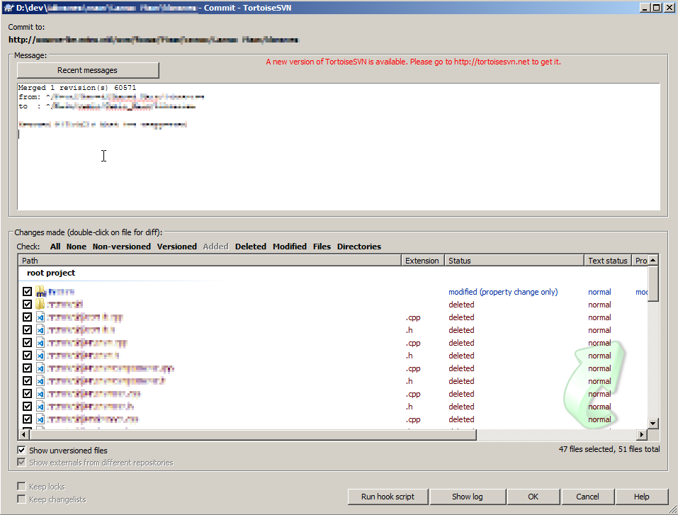
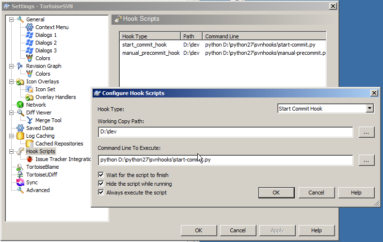

# requirements

python six package

```
$ pip install six
```

# start-commit.py
commit hook to auto generate a merge message

It will list:
* Revision count
* Revision list
* Source branch
* Target branch
* Sanitized commit messages of merged commits:
* Remove empty lines
* Remove jira ID’s to prevent the svn tab in jira from picking up all merges!
* …

Not yet supported:
* Reverse merges 
* Mixed merges (merges and reverse merges combined)


## configuration




